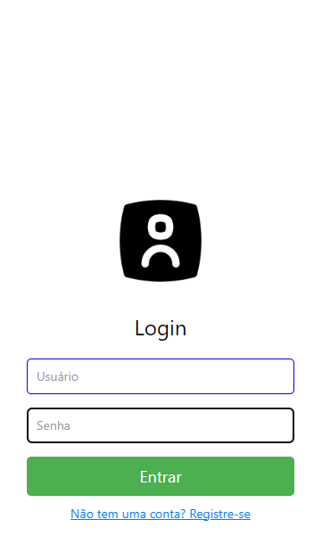
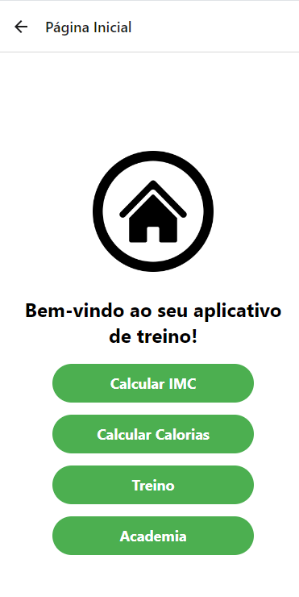
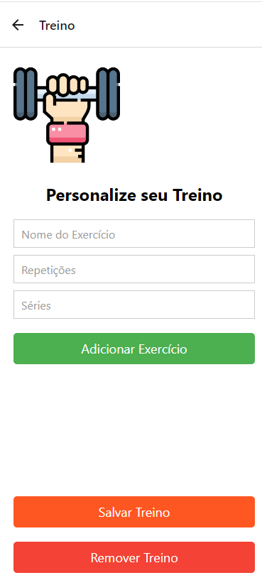

# Relatório Final

Nome: Kawan Mark Geronimo da Silva
RA: 22.222.010-5

# Introdução

Este relatório apresenta o desenvolvimento e os resultados do projeto realizado para a disciplina CCP4670. O projeto consiste na criação de um aplicativo em React Native, abordando o tema de treino e nutrição. O aplicativo visa inclui funcionalidades para montar treinos personalizados, monitorar tempo de treino e descanso, calcular o IMC (Índice de Massa Corporal) e fornecer recomendações nutricionais com base em objetivos específicos de peso com o público alvo sendo pessoas que praticam ou querem praticar exercícios físicos na academia.

# Motivação

A escolha por desenvolver um aplicativo sobre treino e dieta surgiu a partir de da minha própria necessidade de otimizar e acompanhar meus treinos, bem como ajudar outras pessoas a atingirem seus objetivos de saúde e fitness.

Exemplos:
- O aplicativo busca suprir necessidades de treino e dieta, como por exemplo, ter seu próprio treino personalizado pela pessoa, além de cálculos como IMC e também sobre ingestão de calorias. 
- Oportunidade de aprendizado em uma área de grande interesse pessoal: saúde e bem-estar. Além disso, o projeto me permitiu aprimorar minhas habilidades em React Native.
- Muitas pessoas têm dificuldades em montar treinos eficientes, controlar o tempo de atividade e descanso, e fazer um acompanhamento adequado de sua saúde e alimentação. O aplicativo se propõe a solucionar essas questões, oferecendo uma plataforma simples e prática para personalizar treinos, monitorar o tempo de exercício e descanso, calcular IMC e fornecer recomendações nutricionais baseadas nos objetivos do usuário

# Objetivo

O objetivo principal deste projeto é desenvolver um aplicativo mobile funcional em React Native que ajude os usuários a gerenciar seus treinos, monitorar o tempo de atividade e descanso, calcular o IMC e fornecer recomendações nutricionais personalizadas com base nos objetivos de saúde e fitness de cada usuário.

Além disso, o projeto busca:

Além do objetivo principal, o projeto busca:

- Implementar funcionalidades de criação, edição e remoção de treinos personalizados.
- Desenvolver um cronômetro para monitoramento do tempo de treino e descanso na tela de Academia.
- Utilizar o AsyncStorage para armazenar dados de login e preferências do usuário localmente.
- Integrar o Expo Localization para exibir a localização do usuário na tela de Academia.
- Fornecer cálculos de IMC para ajudar os usuários a monitorarem sua saúde e determinar se estão no peso ideal.
- Integrar funcionalidades que melhorem a experiência do usuário, como a exibição da localização real-time e recomendações nutricionais personalizadas.
- Proporcionar uma experiência de usuário intuitiva e agradável, com uma interface limpa e fácil de usar.

# Funcionalidades

O aplicativo desenvolvido conta com as seguintes funcionalidades:

- Montagem de Treino: O usuário pode criar, editar e remover seus próprios treinos. A funcionalidade permite adicionar exercícios, definir séries e repetições, e organizar os treinos de acordo com suas necessidades específicas.

- Cronômetro de Academia: Cronometra o tempo de atividade física e de descanso na academia. O usuário pode iniciar, pausar e resetar o cronômetro, ajudando a manter um controle rigoroso do tempo de treino e descanso.

- Cálculo de IMC: Calcula o Índice de Massa Corporal do usuário com base em informações como altura e peso. O aplicativo fornece feedback sobre se o usuário está abaixo, dentro ou acima do peso ideal, auxiliando no monitoramento da saúde.

- Monitoramento de Calorias: Com base nas informações do usuário e suas metas (emagrecer, engordar ou manter), calcula a quantidade de calorias que devem ser ingeridas diariamente. Esta funcionalidade ajuda no planejamento e controle alimentar.

# Conclusão

A partir do desenvolvimento deste projeto, foi possível concluir os objetivos e enfrentar os desafios. 
- O objetivo principal do projeto foi plenamente atingido. Foi desenvolvido um aplicativo funcional que auxilia os usuários no gerenciamento de seus treinos, cronometra o tempo de atividade na academia, calcula o IMC e monitora a ingestão de calorias.
- O projeto teve alguns desafios, como usar o AsyncStorage para funcionalidades de Login e registro. Além disso, houve problemas com integrações de telas que foram resolvidos usando o NavigationContainer.
- Os aprendizados mais relevantes adquiridos durante o projeto incluem o uso de React Native para desenvolvimento mobile, utilização do Expo para aprimoramento de projeto, além de aprender estilização, usando o css.
- Algumas melhorias que podem ser implementadas no futuro incluem a adição de funcionalidades de socialização, onde os usuários possam compartilhar seus progressos e competir amigavelmente com amigos. Além disso, a integração de novos sensores pode proporcionar um monitoramento mais preciso da atividade física. Melhorias na interface do usuário e na performance do aplicativo também são áreas a serem exploradas

# Outras considerações - Fotos

## Screenshots do Aplicativo

### Tela de Login

### Tela Home

### Tela de Treino

